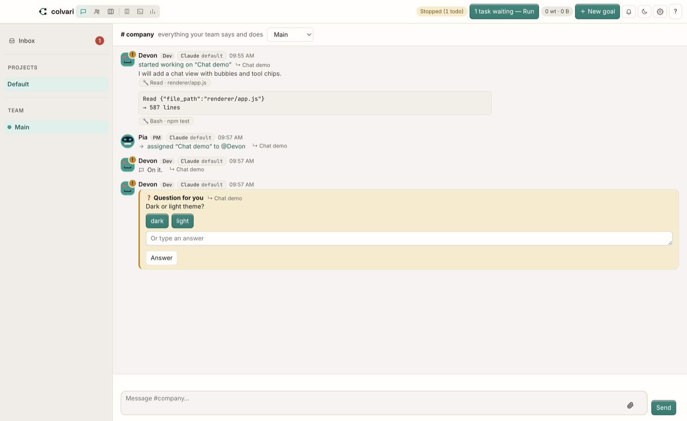
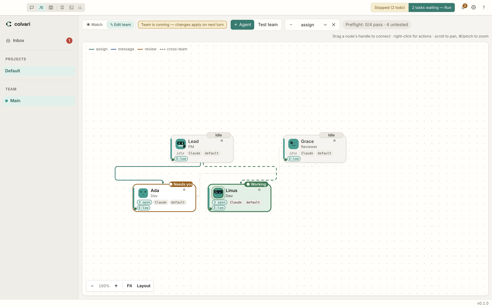
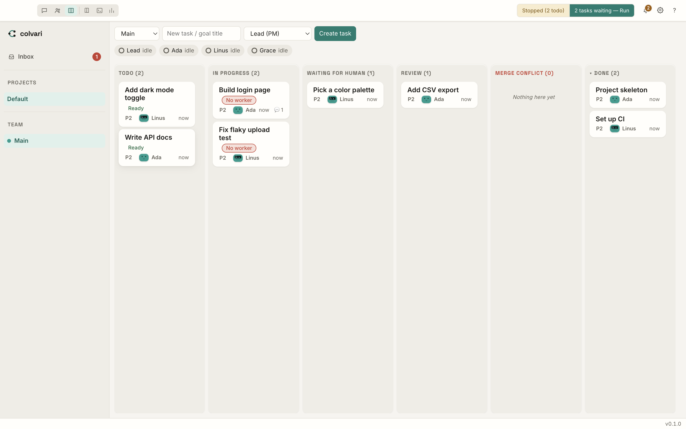
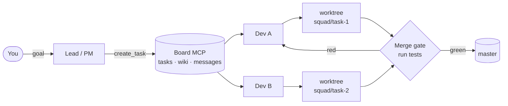

<div align="center">


# Colvari

**A desktop app where a team of AI coding agents works like a small company.**<br>
A Lead/PM plans. Devs take tasks from a board, work in their own git worktrees, and merge only through a test gate.



</div>

## Why Colvari

- **You talk to one Lead, not ten terminals.** Give a goal. The Lead splits it into tasks and hands them out.
- **Agents cannot step on each other.** Each task gets its own git branch and worktree (`squad/<taskId>`).
- **Red code does not reach your main branch.** A task is merged only after the tests pass.

## Features

| Preview | What it does |
|---|---|
|  | **Team map.** Draw your team as a graph. An edge `A → B` says who can assign work to whom, message whom, or review whom. Live status on every node. |
|  | **Task board.** Columns: todo, in progress, waiting for human, review, merge conflict, done. Agents and humans both use it. |
|  | **Chat.** See what every agent says and does. Agents can ask you a question and wait for your answer. |

Also in the app (see [`app/README.md`](app/README.md) for details):

- Shared **wiki** for the team (markdown pages).
- **Logs, Overview and Usage** tabs: tokens per model, cost, usage limits.
- **Run modes** per agent: single, goal (loop until a condition is met), loop, workflow. Found under *Advanced* in agent settings; goal mode needs a runtime that can resume a session.
- **Stall watchdog:** a hung agent is stopped and its session is resumed.
- Per-agent **permissions**: allowed tools, permission mode, working directory.
- Light and dark theme.

## Quick start

You need [Node.js](https://nodejs.org) and the [`claude` CLI](https://docs.claude.com/en/docs/claude-code) on your PATH, logged in.

```bash
git clone https://github.com/danhugo/colvari.git
cd colvari/app
npm install
npm start
```

Then in the app: pick a template (Startup = PM → Dev → Reviewer), then tell the Lead what you want in **Chat**. Your message becomes a task for the Lead, and a stopped team starts on its own.

Check your setup (uses a fake `claude`, no cost):

```bash
npm test
```

## How it works



1. You give a goal. The Lead turns it into tasks on the board.
2. Agents talk only through the **board MCP server**: `list_tasks`, `create_task`, `update_task_status`, `comment_task`, `send_message`, `read_wiki`, `write_wiki`, and more.
3. The edges of your graph are enforced by that server. An agent that tries to assign work outside its edges is refused.
4. Each task runs in its own worktree and branch.
5. When a task is marked `done`, the **merge gate** merges the base branch into the task branch, runs the tests, and lands it with `--no-ff` only if they pass. By default it runs `npm test`. If the tests fail, the task does not land.

Board and wiki are plain files (`.squad/board/tasks/<id>.json`, `.squad/wiki/<slug>.md`), so you can `cat`, `grep` and `jq` them.

## FAQ and limits

**Which agents are supported?** Claude Code is the main runtime. Other CLIs can be added through runtime profiles (Settings → Runtimes). This is less tested than Claude.

**Does it cost money?** Agents are real `claude` runs. They use your subscription or API key. The app shows measured tokens and cost.

**Is it safe?** The default permission mode is `bypassPermissions`. Agents can run commands in their working directory. Change the mode per agent or in Settings if you want more prompts.

**Which platforms?** Developed and tested on macOS. Other systems are untested.

**Is it finished?** No. This is an MVP (version 0.1.0). Expect rough edges.

**Where is my data?** In `~/.agents-squad/` (override with `AGENTS_SQUAD_HOME`). The package and internal names still say `agents-squad`.

## Contributing

Issues and pull requests are welcome. Run `npm test` in `app/` before you open a PR. More docs: [`app/README.md`](app/README.md), [`app/docs/`](app/docs), and the design notes in [`BLUEPRINT.md`](BLUEPRINT.md) (in Vietnamese).

## License

`app/package.json` says MIT, but there is no `LICENSE` file in the repo yet.

<!-- TODO (human): add a LICENSE file (MIT?) so the license is clear. -->
